# Duh! Chess 🎯


## Basic Details
### Team Name: Obsolete


### Team Members
- Team Lead: Edwin Shaju Malakaran - Christ College of Engineering
- Member 2: Gautham Madhav - Christ College of Engineering 

### Project Description
A chess game where YOU don't have to play! AI makes ALL the moves - even yours! Sit back, relax, and watch Marvel vs DC superheroes play chess while you literally do nothing. **"Eat 5 star. Do nothing."**

### The Problem (that doesn't exist)
Everyone plays chess against AI, but that still requires YOU to think and make moves! Why should humans be burdened with the exhausting task of playing their own game? The stress of decision-making in chess is clearly the biggest problem facing gamers today.

### The Solution (that nobody asked for)
We eliminated the most annoying part of chess - YOUR participation! Our revolutionary AI vs AI system makes moves for BOTH players, so you can experience chess without the burden of actually playing. We made it Marvel vs DC themed with live commentary to make watching your own uselessness entertaining!

## Technical Details
### Technologies/Components Used
For Software:
- **Languages**: JavaScript, HTML, CSS
- **Frontend Framework**: React.js with Vite
- **Chess Logic**: Chess.js library
- **Styling**: Custom CSS with animations and gradients
- **Fonts**: Google Fonts (Oswald, Clash Display Variable)
- **Assets**: Custom SVG character pieces for Marvel and DC heroes
- **AI Engine**: Mock Stockfish implementation for automated gameplay

For Hardware:
- Modern web browser
- Computer/laptop with internet connection
- No additional hardware requirements

### Implementation
For Software:

# Architecture Overview
The application follows a modern React architecture with custom components designed to eliminate user interaction:

**Core Components:**
- `SimpleChessArena.jsx` - Main game controller that prevents user input
- `CustomChessBoard.jsx` - Custom chess board with superhero piece rendering
- `ErrorBoundary.jsx` - Handles errors gracefully while you do nothing

**Key Features Implementation:**
- **Automatic Gameplay**: Uses `setTimeout` with 2-second intervals (1.5s animation + 0.5s pause)
- **Piece Identity Tracking**: `pieceTracker` state maintains character identities throughout the game
- **Smooth Animations**: CSS `@keyframes` with 1.5-second duration for piece movements
- **Live Commentary**: Real-time move descriptions using character names
- **Captured Pieces Display**: Shows defeated heroes with original character SVGs

**Anti-User Systems:**
- No click handlers on chess pieces (you can't interfere!)
- AI makes moves for both Marvel and DC sides
- Single "Start" button - your only allowed interaction
- Game runs completely autonomously once started

# Installation
```bash
git clone https://github.com/your-repo/AI-chess.git
cd AI-chess
npm install
```

# Development Run
```bash
npm run dev
```

# Live Demo
Visit `duhchess.vercel.app` to start doing absolutely nothing while watching the superhero chess battle!

### Project Documentation
For Software:


# Screenshots (Add at least 3)


!https://drive.google.com/file/d/1u0MPTMoBHtkx68KZPgARyTjKXnFwpLRU/view?usp=sharing
Before Game Begins, Gameplay

!https://drive.google.com/file/d/1-IR-RtCijQqRr662EKuSYUrwbmSAW6Vb/view?usp=sharing
During Game

!https://drive.google.com/file/d/1shG_fGYKqTs_vKq_sDApZaHRHfQVhY82/view?usp=sharing
During Game

# Diagrams

## Game Workflow - "The Ultimate Useless Experience"

```mermaid
graph TD
    A["🎮 User Visits duhchess.vercel.app"] --> B["📱 Loading Screen Animation"]
    B --> C["🎯 Single 'Start' Button<br/>(Only User Interaction Allowed)"]
    C --> D["🤖 Initialize AI vs AI Game"]
    D --> E["♟️ Marvel AI Makes Move"]
    E --> F["🎬 1.5s Piece Animation"]
    F --> G["💬 Live Commentary Update"]
    G --> H["📊 Update Game State"]
    H --> I["🦸‍♂️ DC AI Makes Move"]
    I --> J["🎬 1.5s Piece Animation"]
    J --> K["💬 Live Commentary Update"]
    K --> L["📊 Update Game State"]
    L --> M{"🏁 Game Over?"}
    M -->|No| E
    M -->|Yes| N["🎉 Winner Popup with Confetti"]
    N --> O["🔄 User Can Reset & Do Nothing Again"]
    
    style A fill:#ff6b6b
    style C fill:#4ecdc4
    style E fill:#45b7d1
    style I fill:#96ceb4
    style N fill:#feca57
```


## Technical Architecture - "How We Eliminated Your Participation"


## Character Battle Setup - "Marvel vs DC Showdown"

```mermaid
graph LR
    subgraph "🦸‍♂️ Marvel Team (White Pieces)"
        M1["👑 Iron Man<br/>(King)"]
        M2["👸 Scarlet Witch<br/>(Queen)"]
        M3["🏰 Thor<br/>(Rook)"]
        M4["🏰 Captain Marvel<br/>(Rook)"]
        M5["⛪ Doctor Strange<br/>(Bishop)"]
        M6["⛪ Vision<br/>(Bishop)"]
        M7["🐎 Black Panther<br/>(Knight)"]
        M8["🐎 Spider-Man<br/>(Knight)"]
        M9["♟️ 8 Avengers<br/>(Pawns)"]
    end
    
    subgraph "🦸‍♀️ DC Team (Black Pieces)"
        D1["👑 Superman<br/>(King)"]
        D2["👸 Wonder Woman<br/>(Queen)"]
        D3["🏰 Green Lantern<br/>(Rook)"]
        D4["🏰 Shazam<br/>(Rook)"]
        D5["⛪ Martian Manhunter<br/>(Bishop)"]
        D6["⛪ Cyborg<br/>(Bishop)"]
        D7["🐎 Flash<br/>(Knight)"]
        D8["🐎 Batman<br/>(Knight)"]
        D9["♟️ 8 Justice League<br/>(Pawns)"]
    end
    
    subgraph "⚔️ Battle Arena"
        BOARD["🏁 8x8 Chessboard<br/>AI vs AI Combat"]
    end
    
    M1 --> BOARD
    M2 --> BOARD
    M3 --> BOARD
    M4 --> BOARD
    M5 --> BOARD
    M6 --> BOARD
    M7 --> BOARD
    M8 --> BOARD
    M9 --> BOARD
    
    D1 --> BOARD
    D2 --> BOARD
    D3 --> BOARD
    D4 --> BOARD
    D5 --> BOARD
    D6 --> BOARD
    D7 --> BOARD
    D8 --> BOARD
    D9 --> BOARD
    
    style M1 fill:#ff6b6b
    style M2 fill:#ff6b6b
    style M3 fill:#ff6b6b
    style M4 fill:#ff6b6b
    style M5 fill:#ff6b6b
    style M6 fill:#ff6b6b
    style M7 fill:#ff6b6b
    style M8 fill:#ff6b6b
    style M9 fill:#ff6b6b
    
    style D1 fill:#4ecdc4
    style D2 fill:#4ecdc4
    style D3 fill:#4ecdc4
    style D4 fill:#4ecdc4
    style D5 fill:#4ecdc4
    style D6 fill:#4ecdc4
    style D7 fill:#4ecdc4
    style D8 fill:#4ecdc4
    style D9 fill:#4ecdc4
    
    style BOARD fill:#ffe66d
```

# Key Features Breakdown

**🎮 Game Interface:**
- **Custom Chessboard**: 8x8 grid with black/white squares and coordinate labels (a1-h8)
- **Superhero Pieces**: 32 unique SVG characters (16 Marvel vs 16 DC)
- **Sidebar Layout**: Left sidebar for controls, right sidebar for captured pieces and commentary
- **Responsive Design**: Dynamic board sizing based on screen dimensions

**🤖 AI System:**
- **Mock Stockfish Engine**: Simulates chess AI for automated move generation
- **Dual AI Control**: Separate AI systems for Marvel and DC sides
- **Move Validation**: Uses Chess.js library for legal move checking
- **Game State Management**: Tracks piece positions, captured pieces, and game status

**🎬 Animation System:**
- **Piece Movement**: Smooth 1.5-second CSS transitions between squares
- **Knight Hopping**: Special L-shaped animation for knight moves
- **Linear Movement**: Step-by-step animation for rooks, bishops, and queens
- **Winner Popup**: Animated celebration with confetti effects

**💬 Commentary Features:**
- **Character Names**: Uses superhero identities in move descriptions
- **Real-time Updates**: Live feed of game events and captures
- **Auto-scroll**: Commentary automatically scrolls to show latest moves
- **Capture Notifications**: Special alerts when heroes are defeated

**🦸‍♂️ Character System:**
- **Marvel Team**: Iron Man (King), Scarlet Witch (Queen), Thor & Captain Marvel (Rooks), Doctor Strange & Vision (Bishops), Black Panther & Spider-Man (Knights), 8 unique Avengers (Pawns)
- **DC Team**: Superman (King), Wonder Woman (Queen), Green Lantern & Shazam (Rooks), Martian Manhunter & Cyborg (Bishops), Flash & Batman (Knights), 8 unique Justice League members (Pawns)
- **Persistent Identity**: Each piece maintains its character throughout the game, even when captured

# Technical Architecture
```
User Interface Layer
├── App.jsx (Loading screen + Error boundary)
├── SimpleChessArena.jsx (Main game controller)
└── CustomChessBoard.jsx (Board rendering + animations)

Game Logic Layer
├── Chess.js library (Move validation + game rules)
├── Mock Stockfish (AI move generation)
└── Piece Identity Tracker (Character persistence)

Styling Layer
├── Custom CSS animations
├── Google Fonts integration
└── Responsive design system
```

For Hardware:
*This is a pure software project - no hardware components required*

### Project Demo
# Video
duhchess.vercel.app
Video demonstrates: Auto-playing chess game with Marvel vs DC characters, smooth piece animations, live commentary system, and captured pieces display

# Additional Demos
- **Live deployment**: `duhchess.vercel.app` - Experience the ultimate uselessness!
- **Character roster showcase**: All 32 unique superhero pieces with their special designs
- **Animation demonstrations**: Piece movement animations including knight L-shaped moves and linear movements
- **Commentary system**: Real-time character-based move descriptions
- **Automatic gameplay**: Watch AI vs AI battles without any user input required

## Team Contributions
- Edwin Shaju Malakaran: Frontend development, React components, chess board implementation, piece animations, making sure users can't interfere with the game
- Gautham Madhav: Character design system, SVG assets creation, Marvel vs DC piece mapping, UI/UX design, commentary system to make uselessness entertaining

---
Made with ❤ at TinkerHub Useless Projects 


